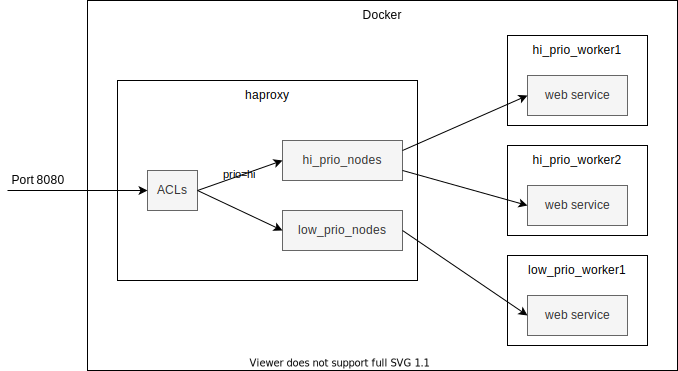
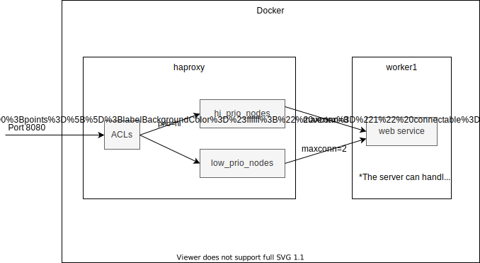

# QoS: Prioritizing Service Requests with HAProxy

**A sample project demonstrating how to setup HAProxy for load balancing and Quality of Service (QoS).**

This project shows how to prioritize the incoming web service requests by some criteria and how to ensure that each request is treated appropriately to it's priority. Simply said, a request with high priority is served before a rquest with low priority.

HAProxy allows you to organize servers into groups (backends) and forward traffic to these groups based on some contidions (ACLs).  You can define these conditions using any aspect of a request or response such as headers, an url, query parameters, etc.


Examples:

- [Cluster with Priority Groups](#Example 1: Cluster with Priority Groups)
- [Single Instance with HAProxy Queue](#Example 2: Single Instance with HAProxy Queue)
- TBD: Limiting CPU and Memory Usage with Docker
- TBD: Limiting CPU and Memory Usage with Docker using cgroups


## Example 1: Cluster with Priority Groups




Provided is a [Docker Compose](https://docs.docker.com/compose/) file that will setup [HAProxy](http://www.haproxy.org/) for routing and 3 instances of a a simple REST web service using [Spring Boot](https://spring.io/projects/spring-boot). The REST web service just returns the server name on witch the service runs.

The service requests containing the query parameter `prio=hi` or the url pattern `*/important/*` will be forwarded to the instances `hi_prio_worker_1` and `hi_prio_worker_2`. Other requests go to `low_prio_worker_1`.


### Setup HAProxy and 3 service instanses

docker-compose.yml:

```
version: "3"

services:
  hi_prio_worker_1:
    image: greenstones/qos-groups-worker
    environment:
      NODE_NAME: hi_prio_worker_1

  hi_prio_worker_2:
    image: greenstones/qos-groups-worker
    environment:
      NODE_NAME: hi_prio_worker_2

  low_prio_worker_1:
    image: greenstones/qos-groups-worker
    environment:
      NODE_NAME: low_prio_worker_1

  haproxy:
    image: haproxy
    volumes:
      - ./haproxy:/usr/local/etc/haproxy:ro
    ports:
      - 8080:8080
      - 9091:9091
```


### HAProxy Configuration

haproxy/haproxy.cfg:

```bash
...
frontend localnodes
    bind *:8080
    mode http

		# check if the request contains the query param "prio" with the value "hi"
    acl has_prio_param urlp(prio) hi
    # if true, forward to "hi_prio_nodes" backend 
    use_backend hi_prio_nodes if has_prio_param

		# check if the request url conatins the substring "important"
    acl is_prio_url path_sub important
    # if true, forward to "hi_prio_nodes" backend 
    use_backend hi_prio_nodes if is_prio_url

    default_backend low_prio_nodes

backend hi_prio_nodes
    mode http
    balance roundrobin
    ...
    server hi_prio_worker_1 hi_prio_worker_1:8080
    server hi_prio_worker_2 hi_prio_worker_2:8080

backend low_prio_nodes
    mode http
    ...
    server low_prio_worker_1 low_prio_worker_1:8080

...

```


### Start the Docker instances with Docker Compose.

```bash
$ docker-compose up -d
Creating qos-groups_hi_prio_worker_1_1  ... done
Creating qos-groups_low_prio_worker_1_1 ... done
Creating qos-groups_haproxy_1           ... done
Creating qos-groups_hi_prio_worker_2_1  ... done

$ docker ps
CONTAINER ID        IMAGE                           COMMAND                  CREATED             STATUS              PORTS                                            NAMES
028f97b19eee        greenstones/qos-groups-worker   "java -jar /worker.j…"   32 seconds ago      Up 30 seconds                                                        qos-groups_low_prio_worker_1_1
f34e78f7bc4d        greenstones/qos-groups-worker   "java -jar /worker.j…"   32 seconds ago      Up 30 seconds                                                        qos-groups_hi_prio_worker_2_1
2dcffae9aacd        haproxy                         "/docker-entrypoint.…"   32 seconds ago      Up 30 seconds       0.0.0.0:8080->8080/tcp, 0.0.0.0:9091->9091/tcp   qos-groups_haproxy_1
78253d06ee35        greenstones/qos-groups-worker   "java -jar /worker.j…"   32 seconds ago      Up 30 seconds                                                        qos-groups_hi_prio_worker_1_1

```

The load balancer for the web service will be running at  http://localhost:8080 and a stats console at http://localhost:9091/stats.


### Test the Reverse Proxy and Load Balancing

```bash
$ curl http://localhost:8080/test
request processed by node 'low_prio_worker_1'

$ curl http://localhost:8080/test?prio=hi
request processed by node 'hi_prio_worker_1'

$ curl http://localhost:8080/test/abc?prio=hi
request processed by node 'hi_prio_worker_2'

$ curl http://localhost:8080/test/abc?prio=low
request processed by node 'low_prio_worker_1'

$ curl http://localhost:8080/test/abc/important
request processed by node 'hi_prio_worker_1'

$ curl http://localhost:8080/test/abc/important/efg
request processed by node 'hi_prio_worker_2'
```


## Example 2: Single Instance with HAProxy Queue





## Optional: Build the Docker image from source

```bash
mvn clean package
```

